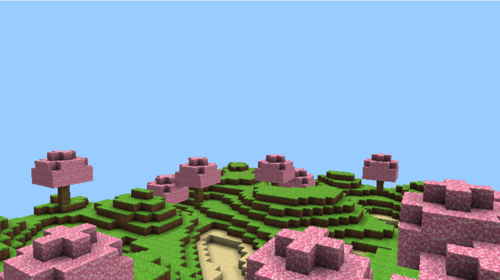

<h1 class="code-line" data-line-start=0 data-line-end=1 >Minecraft Clone: Infinite Terrain Exploration</h1>

This Minecraft clone is a voxel-based 3D world generator that focuses on creating an expansive and immersive environment. While core gameplay elements such as crafting or survival mechanics are not yet implemented, the foundation of the world is already set, featuring:

<ul>
<li class="has-line-data" data-line-start="6" data-line-end="9">

Infinite Random Terrain Generation 
The terrain is procedurally generated, offering endless exploration in every direction. Using noise algorithms like Perlin or Simplex noise, the world is filled with hills, valleys, mountains, and flatlands, creating a dynamic landscape that continuously evolves as you move.

</li>
<li class="has-line-data" data-line-start="9" data-line-end="12">

Variety of Textures 
Each block in the world is textured, with different types of materials such as grass, dirt, stone, and water represented. These textures help differentiate between landforms, adding depth and visual appeal to the terrain. More unique textures are in the works to represent additional biomes and features.

</li>
<li class="has-line-data" data-line-start="12" data-line-end="15">

Forests with Trees 
Scattered throughout the terrain, you’ll find clusters of procedurally generated trees. Each tree is built from textured blocks, adding life and variety to the landscape. The tree generation algorithm ensures that forests feel natural and random, with a mix of large and small trees.

</li>
<li class="has-line-data" data-line-start="15" data-line-end="16">

Though gameplay mechanics are not yet implemented, this project serves as the perfect foundation for building a fully functional voxel-based game. Future updates will focus on player interactions, resource gathering, crafting, and more.

</li>
</ul>
